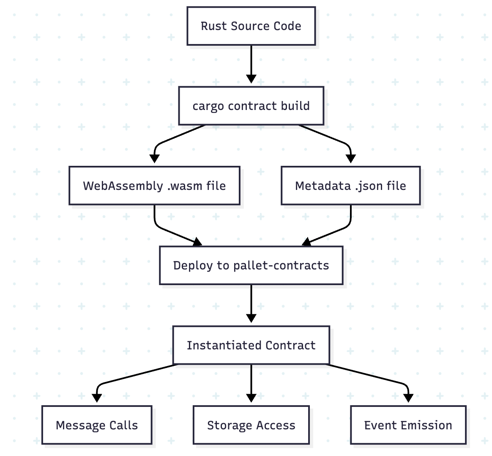

# Chapter 1: The ink! Paradigm: Rust on the Blockchain

ink! is a domain-specific language (DSL) embedded in Rust, designed specifically for writing smart contracts that compile to WebAssembly (Wasm). It leverages Rust's renowned safety features—such as type safety, memory safety, and absence of undefined behaviors—to create secure and efficient smart contracts for blockchains built on the polkadot-sdk framework, including ecosystems like Polkadot and Kusama.

When you first sit down to write a smart contract that will move real value and coordinate real people, you discover that language is not just syntax and semantics, but a shape that a system grows into. ink! is such a language: pragmatic because it is Rust, safe because it borrows Rust's strict guarantees, fast because it compiles to Wasm, and open to composition because it lives inside polkadot-sdk's contracts pallet. This book is a long walk through the craft of building production-ready contracts with ink!. We will code, of course, but more importantly we will learn how to think in ink!: how to choose data structures that the chain can love, how to shape interfaces that people and programs can trust, and how to ship software that can bear the weight of other people’s money.

ink! is ideal for developers familiar with blockchain concepts (e.g., smart contracts, gas fees, state management) who want to build on polkadot-sdk-based networks. It targets parachains like Aleph Zero, Phala, or Astar, where smart contracts run in a Wasm environment via the pallet-contracts module. For examples and further reading, explore the official GitHub repository for ink! examples, which includes basic contracts like flipper (a simple state toggler), ERC20 (token standard), ERC721 (NFTs), and incrementer (counter demo).

These demonstrate core features such as state management, events, and cross-contract calls.This book will guide you through fundamentals, writing contracts, testing, debugging, and deployment, assuming basic blockchain knowledge.

## Understanding the Blockchain Foundation

A blockchain is a ledger in the open—blocks stacked in time, each one linked by a cryptographic hash to the one before it, so that to change yesterday you would have to break today. There is comfort in that: a public memory that resists forgetting. On such a ledger, a smart contract is a promise written as code. Instead of a human arbiter there is a virtual machine; instead of a notary there is consensus; instead of signatures there are transactions; instead of trust there is determinism. If the conditions are satisfied, the program executes; if they are not, the program refuses. No midnight renegotiations. No partial truths. Just state transitions anyone can verify. The result is programmable money, programmable organizations, programmable markets—systems that are transparent because they cannot lie, and accountable because they cannot hide.

Before diving into ink! development, let's establish the foundational concepts that make smart contracts possible and understand why they represent a revolutionary approach to building decentralized applications.

### What is a Blockchain?

A blockchain is a distributed ledger technology that maintains a continuously growing list of records (blocks) that are linked and secured using cryptography. Each block contains:

- **A cryptographic hash** of the previous block
- **A timestamp** indicating when the block was created
- **Transaction data** representing state changes in the system

This structure creates an immutable chain where altering any historical record would require recomputing all subsequent blocks—a computationally infeasible task in a properly designed system.

**Key Properties of Blockchains:**

1. **Decentralization**: No single point of control or failure
2. **Immutability**: Historical records cannot be altered without detection
3. **Transparency**: All transactions are publicly verifiable
4. **Consensus**: Network participants agree on the current state through consensus mechanisms
5. **Trustlessness**: Participants don't need to trust each other, only the protocol

### The Evolution from Simple Transfers to Smart Contracts

Early blockchains like Bitcoin primarily handled simple value transfers: Alice sends X coins to Bob. While revolutionary, this model was limited to basic financial transactions.

**The Smart Contract Revolution:**

Smart contracts extend blockchain capabilities by enabling **programmable money** and **decentralized applications (dApps)**. Instead of just transferring value, participants can:

- Lock funds in escrow with automatic release conditions
- Create complex financial instruments (loans, derivatives, insurance)
- Build decentralized governance systems
- Implement supply chain tracking and verification
- Create non-fungible tokens (NFTs) and digital collectibles

### What Are Smart Contracts?

A smart contract is **self-executing code** deployed on a blockchain that automatically enforces the terms of an agreement. Think of it as a vending machine for digital assets:

1. **Deposit conditions are met** (correct payment, valid inputs)
2. **Contract logic executes** (verification, calculations, state changes)
3. **Outcomes are automatically enforced** (assets transferred, events emitted)

But smart contracts also need a home, an execution environment that enforces limits and fairness. Some communities choose the EVM and its battle-scarred, hand‑crafted bytecode. We choose WebAssembly: a compact, fast, and portable instruction format with real compilers and real tooling, and we choose Rust to reach it, because in Rust the programmer must make memory safe by design—no nulls, no data races, no silent integer overflows unless you ask for them on purpose. That is the ethos ink! brings to polkadot-sdk's world: write contracts as normal Rust modules, with a few macros to reveal your storage and messages, compile to Wasm, and let `pallet-contracts` host your logic on chain.

**Key Characteristics:**

- **Deterministic**: Same inputs always produce same outputs
- **Immutable**: Code cannot be changed once deployed (unless designed with upgrade mechanisms)
- **Transparent**: Code and execution are publicly verifiable
- **Autonomous**: Execute without human intervention
- **Tamper-proof**: Protected by blockchain's cryptographic security

### Smart Contract Use Cases

**Financial Services (DeFi):**
- Decentralized exchanges (DEXs) for trading without intermediaries
- Lending protocols that automatically manage collateral and interest
- Yield farming and liquidity mining programs
- Algorithmic stablecoins with automatic supply adjustments

**Digital Identity and Governance:**
- Decentralized Autonomous Organizations (DAOs) with voting mechanisms
- Identity verification systems without central authorities
- Reputation systems based on verifiable on-chain activity

**Supply Chain and Real-World Assets:**
- Tracking products from manufacture to consumer
- Carbon credit trading and environmental monitoring
- Real estate tokenization and fractional ownership
- Insurance claims processing with automated payouts

### The Technical Challenge: Execution Environments

Smart contracts need a **virtual machine** that can:

1. **Execute code deterministically** across all network nodes
2. **Meter resource usage** to prevent infinite loops and denial-of-service attacks
3. **Manage state** persistently between contract calls
4. **Handle failures gracefully** without corrupting blockchain state

Different blockchain platforms have approached this challenge in various ways:

- **Ethereum Virtual Machine (EVM)**: Stack-based virtual machine with gas metering
- **WebAssembly (Wasm)**: Near-native performance with sandboxed execution
- **Move Virtual Machine**: Resource-oriented programming with formal verification

## The Smart Contract Development Landscape

Smart contracts have revolutionized how we think about decentralized applications, but most existing solutions come with significant trade-offs. Let's examine the current landscape:

### Current Platforms and Their Limitations

**Ethereum and Solidity:**
- **Pros**: Mature ecosystem, extensive tooling, large developer community
- **Cons**: High gas costs, limited throughput, memory safety vulnerabilities
- **Key Issue**: Solidity lacks compile-time safety guarantees that prevent entire classes of bugs

**Cosmos and CosmWasm:**
- **Pros**: Inter-blockchain communication, modular architecture
- **Cons**: Smaller ecosystem, Go/Rust context switching complexity
- **Key Issue**: Complex multi-language development environment

**Aptos/Sui and Move:**
- **Pros**: Resource-oriented programming, formal verification capabilities
- **Cons**: Completely new paradigm, limited ecosystem maturity
- **Key Issue**: Requires learning fundamentally different programming concepts

### Enter ink!: The Rust Advantage

ink! takes a different approach: it leverages the mature, battle-tested Rust ecosystem to bring memory safety, type safety, and performance to smart contract development. Rather than inventing new paradigms, ink! builds upon established Rust patterns that developers already know and trust.

**Why This Matters:**

1. **Existing Expertise**: Rust developers can apply their knowledge directly
2. **Proven Patterns**: Leverage established error handling, testing, and architectural patterns
3. **Ecosystem Access**: Use (compatible) crates from the broader Rust ecosystem
4. **Tool Maturity**: Benefit from Rust's excellent tooling and IDE support

In this chapter, we'll explore why ink! represents a paradigm shift in smart contract development, how it compares to existing solutions, and where it fits within the broader polkadot-sdk ecosystem. We'll then set up a complete development environment so you're ready to start building.

## Why ink!? The Rust Advantage

### Memory Safety Without Garbage Collection

Traditional smart contract platforms either sacrifice memory safety (C++) or rely on garbage collection (Ethereum's EVM, which impacts gas costs). Rust's ownership system provides memory safety guarantees at compile time without runtime overhead.

Consider this common vulnerability in C-style languages:

```c
// Potential buffer overflow
char buffer[100];
strcpy(buffer, user_input); // No bounds checking!
```

In Rust, this simply cannot compile:

```rust
// This won't compile - Rust prevents buffer overflows at compile time
let mut buffer = [0u8; 100];
let user_input: &[u8] = get_user_input();
buffer[..user_input.len()].copy_from_slice(user_input); // Bounds checked
```

This compile-time safety extends to smart contracts. Memory-related vulnerabilities that have caused millions in losses on other platforms are prevented by design in ink!.

### Zero-Cost Abstractions

Rust's "zero-cost abstractions" philosophy means that high-level code constructs compile down to the same efficiency as hand-optimized low-level code. In the context of smart contracts, this translates directly to gas efficiency.

```rust
// High-level iterator chain
let result: u32 = numbers
    .iter()
    .filter(|&x| x % 2 == 0)
    .map(|&x| x * x)
    .sum();

// Compiles to the same efficiency as:
let mut result = 0u32;
for number in numbers {
    if number % 2 == 0 {
        result += number * number;
    }
}
```

### Type System Guarantees

Rust's type system prevents entire categories of bugs that are common in smart contracts:

```rust
// This won't compile - prevents integer overflow vulnerabilities
fn transfer(amount: u128) -> Result<(), Error> {
    let new_balance = self.balance + amount; // Compiler error if overflow possible
    // Must use checked_add, saturating_add, or wrapping_add
    Ok(())
}

// Correct approach
fn transfer(amount: u128) -> Result<(), Error> {
    let new_balance = self.balance
        .checked_add(amount)
        .ok_or(Error::ArithmeticOverflow)?;
    self.balance = new_balance;
    Ok(())
}
```

### Ecosystem Maturity

Rust has a mature ecosystem with crates.io hosting over 100,000 packages. While ink! contracts run in a `no_std` environment (limiting available crates), you still have access to:

- **Cryptographic libraries**: `sp-crypto`, `secp256k1`, etc.
- **Data structures**: `BTreeMap`, `BTreeSet` from `alloc`
- **Serialization**: `scale-codec` for efficient encoding
- **Mathematical operations**: Fixed-point arithmetic libraries

## ink! vs. Solidity: A Technical Comparison

Let's examine the fundamental differences through equivalent contract implementations:

### Solidity ERC-20 Token (Simplified)

```javascript
pragma solidity ^0.8.0;

contract SimpleToken {
    mapping(address => uint256) private balances;
    uint256 private totalSupply;
    
    constructor(uint256 _totalSupply) {
        totalSupply = _totalSupply;
        balances[msg.sender] = _totalSupply;
    }
    
    function transfer(address to, uint256 amount) public returns (bool) {
        require(balances[msg.sender] >= amount, "Insufficient balance");
        balances[msg.sender] -= amount;
        balances[to] += amount;
        return true;
    }
    
    function balanceOf(address account) public view returns (uint256) {
        return balances[account];
    }
}
```

### ink! ERC-20 Token (Simplified)

```rust
#![cfg_attr(not(feature = "std"), no_std)]

#[ink::contract]
mod simple_token {
    use ink::storage::Mapping;

    #[ink(storage)]
    pub struct SimpleToken {
        total_supply: Balance,
        balances: Mapping<AccountId, Balance>,
    }

    #[derive(Debug, PartialEq, Eq, scale::Encode, scale::Decode)]
    #[cfg_attr(feature = "std", derive(scale_info::TypeInfo))]
    pub enum Error {
        InsufficientBalance,
        ArithmeticOverflow,
    }

    impl SimpleToken {
        #[ink(constructor)]
        pub fn new(total_supply: Balance) -> Self {
            let mut balances = Mapping::default();
            let caller = Self::env().caller();
            balances.insert(caller, &total_supply);
            
            Self {
                total_supply,
                balances,
            }
        }

        #[ink(message)]
        pub fn transfer(&mut self, to: AccountId, amount: Balance) -> Result<(), Error> {
            let caller = self.env().caller();
            let caller_balance = self.balances.get(caller).unwrap_or(0);
            
            if caller_balance < amount {
                return Err(Error::InsufficientBalance);
            }
            
            let new_caller_balance = caller_balance
                .checked_sub(amount)
                .ok_or(Error::ArithmeticOverflow)?;
            
            let to_balance = self.balances.get(to).unwrap_or(0);
            let new_to_balance = to_balance
                .checked_add(amount)
                .ok_or(Error::ArithmeticOverflow)?;
            
            self.balances.insert(caller, &new_caller_balance);
            self.balances.insert(to, &new_to_balance);
            
            Ok(())
        }

        #[ink(message)]
        pub fn balance_of(&self, account: AccountId) -> Balance {
            self.balances.get(account).unwrap_or(0)
        }
    }
}
```

### Key Differences Analysis

| Aspect | Solidity | ink! |
|--------|----------|------|
| **Memory Safety** | Runtime checks only | Compile-time guarantees |
| **Integer Overflow** | Silent overflow (pre-0.8) or panic | Explicit handling required |
| **Error Handling** | `require()` statements | `Result<T, E>` types |
| **Type Safety** | Dynamic typing elements | Strict static typing |
| **Testing** | External frameworks | Built-in unit and E2E testing |
| **Compilation Target** | EVM bytecode | WebAssembly |

### Performance Implications

WebAssembly execution offers several advantages over EVM bytecode:

1. **Near-native Performance**: Wasm can achieve 95%+ of native execution speed
2. **Smaller Code Size**: More efficient encoding reduces storage costs
3. **Better Tooling**: Standard debugging and profiling tools work with Wasm

Benchmark comparison for a simple transfer operation:
- **EVM**: ~21,000 gas
- **ink!/Wasm**: ~15,000 gas equivalent (varies by implementation)

## The polkadot-sdk Stack: Where ink! Fits

Understanding ink!'s place in the polkadot-sdk ecosystem is crucial for effective development.

### polkadot-sdk Architecture Layers

```
┌─────────────────────────────────────────┐
│            Runtime (STF)                │
│  ┌─────────────┐  ┌─────────────────┐   │
│  │   Pallets   │  │ pallet-contracts│   │
│  │             │  │                 │   │
│  │ - Balances  │  │  ┌───────────┐  │   │
│  │ - Timestamp │  │  │ink!       │  │   |
│  │ - System    │  │  │Contracts  │  │   │
│  │ - ...       │  │  └───────────┘  │   │
│  └─────────────┘  └─────────────────┘   │
└─────────────────────────────────────────┘
┌─────────────────────────────────────────┐
│            Consensus Layer              │
└─────────────────────────────────────────┘
┌─────────────────────────────────────────┐
│            Networking Layer             │
└─────────────────────────────────────────┘
```

### pallet-contracts: The Execution Environment

The `pallet-contracts` pallet provides:

1. **Wasm Virtual Machine**: Executes compiled ink! contracts
2. **Gas Metering**: Prevents infinite loops and resource exhaustion
3. **Storage Management**: Persistent key-value storage for contracts
4. **Call Stack Management**: Handles cross-contract calls
5. **Event Emission**: Allows contracts to emit events for off-chain consumption

### Comparison with Native Pallets

| Feature | Native Pallet | ink! Contract |
|---------|---------------|---------------|
| **Performance** | Highest (native Rust) | High (Wasm overhead ~5-10%) |
| **Flexibility** | Requires runtime upgrade | Deployable anytime |
| **Gas Costs** | No gas (weight-based) | Gas metered execution |
| **Upgradability** | Hard fork required | Proxy patterns possible |
| **Development Complexity** | Higher (runtime knowledge) | Lower (contract-focused) |

### ink! Contract Lifecycle




## Setting Up Your Development Environment

Let's establish a complete development environment for ink! contract development.

### Step 1: Install Rust

First, ensure you have the latest stable Rust toolchain:

```bash
# Install Rust via rustup (if not already installed)
curl --proto '=https' --tlsv1.2 -sSf https://sh.rustup.rs | sh

# Reload your shell or source the environment
source ~/.cargo/env

# Verify installation
rustc --version
# Should output: rustc 1.75.0 (stable)
```

### Step 2: Configure the Rust Toolchain

ink! contracts compile to WebAssembly, requiring the Wasm target:

```bash
# Add the WebAssembly target
rustup target add wasm32-unknown-unknown

# Verify the target is installed
rustup target list --installed | grep wasm32
# Should output: wasm32-unknown-unknown
```

For optimal development experience, also install useful components:

```bash
# Add clippy for linting
rustup component add clippy

# Add rustfmt for code formatting
rustup component add rustfmt

# Verify components are installed
cargo clippy --version
cargo fmt --version
```

### Step 3: Install cargo-contract

`cargo-contract` is the primary command-line tool for ink! development:

```bash
# Install the latest version
cargo install --force --locked cargo-contract

# Verify installation
cargo contract --version
# Should output: cargo-contract-contract 4.0.0
```

### Step 4: Verify Your Setup

Create a test project to verify everything works:

```bash
# Create a new directory for testing
mkdir ~/ink-test && cd ~/ink-test

# Generate a new ink! project
cargo contract new flipper

# Navigate to the project
cd flipper

# Build the contract
cargo contract build

# Verify build artifacts
ls -la target/ink/
# Should contain: flipper.wasm, flipper.json, flipper.contract
```

Expected output structure:

```
target/ink/
├── flipper.wasm      # Compiled WebAssembly binary
├── flipper.json      # Contract metadata
└── flipper.contract  # Bundle file (contains both .wasm and .json)
```

### Step 5: Install a Local Test Node

For testing and development, install `substrate-contracts-node`:

```bash
# Install the contracts node
cargo install contracts-node --git https://github.com/paritytech/substrate-contracts-node.git

# Start the node (in a separate terminal)
substrate-contracts-node --dev --tmp

# The node should start and begin producing blocks
# Keep this running in a separate terminal session
```

Expected output:
```
2024-01-15 10:30:00 polkadot-sdk Contracts Node
2024-01-15 10:30:00 Running in --dev mode, RPC CORS has been disabled.
2024-01-15 10:30:00 Local node identity is: 12D3KooW...
2024-01-15 10:30:06 💤 Idle (0 peers), best: #0 (0x1234...), finalized #0
2024-01-15 10:30:12 💤 Idle (0 peers), best: #1 (0x5678...), finalized #0
```

### Step 6: Install Additional Development Tools

For enhanced development experience:

```bash
# Install polkadot-js-api CLI tools (optional, for advanced interaction)
npm install -g @polkadot/api-cli

# Install substrate development tools (optional)
cargo install subxt-cli
```

### Environment Configuration

Create a development configuration file to standardize your setup:

```bash
# Create a config directory
mkdir -p ~/.config/ink-dev

# Create an environment configuration file
cat > ~/.config/ink-dev/config.toml << 'EOF'
[environment]
node_url = "ws://127.0.0.1:9944"
default_account = "//Alice"

[build]
optimization_passes = "Z"
keep_debug_symbols = false

[deployment]
gas_limit = "1000000000000"
value = "0"
EOF
```

### IDE Setup Recommendations

For the best development experience, configure your IDE:

#### Visual Studio Code

Install these extensions:

```bash
code --install-extension rust-lang.rust-analyzer
code --install-extension vadimcn.vscode-lldb
code --install-extension serayuzgur.crates
```

Create a workspace configuration (`.vscode/settings.json`):

```json
{
    "rust-analyzer.cargo.features": ["std"],
    "rust-analyzer.checkOnSave.command": "clippy",
    "rust-analyzer.cargo.target": "wasm32-unknown-unknown",
    "files.watcherExclude": {
        "**/target/**": true
    }
}
```

#### Vim/Neovim

Add to your configuration:

```vim
" For rust-analyzer LSP support
Plug 'neovim/nvim-lspconfig'
Plug 'rust-lang/rust.vim'

" Configure rust-analyzer
lua << EOF
require'lspconfig'.rust_analyzer.setup{
    settings = {
        ["rust-analyzer"] = {
            cargo = {
                target = "wasm32-unknown-unknown",
                features = {"std"}
            }
        }
    }
}
EOF
```

### Troubleshooting Common Setup Issues

#### Issue: `cargo contract` not found

**Solution**: Ensure `~/.cargo/bin` is in your `PATH`:

```bash
echo 'export PATH="$HOME/.cargo/bin:$PATH"' >> ~/.bashrc
source ~/.bashrc
```

#### Issue: Wasm target not found during build

**Solution**: Reinstall the Wasm target:

```bash
rustup target remove wasm32-unknown-unknown
rustup target add wasm32-unknown-unknown
```

#### Issue: Permission denied when installing `contracts-node`

**Solution**: Use local installation:

```bash
# Install to a local directory
cargo install contracts-node --git https://github.com/paritytech/substrate-contracts-node.git --root ~/.local

# Add to PATH
echo 'export PATH="$HOME/.local/bin:$PATH"' >> ~/.bashrc
source ~/.bashrc
```

#### Issue: Build fails with "linker not found"

**Solution**: Install build essentials:

```bash
# On Ubuntu/Debian
sudo apt-get install build-essential

# On macOS
xcode-select --install

# On Windows (use WSL or install Visual Studio Build Tools)
```

### Verification Checklist

Before proceeding to the next chapter, verify your environment:

- [ ] `rustc --version` shows stable Rust 1.75+
- [ ] `rustup target list --installed` includes `wasm32-unknown-unknown`
- [ ] `cargo contract --version` shows 4.0+
- [ ] `cargo contract new test && cd test && cargo contract build` succeeds
- [ ] `substrate-contracts-node --dev` starts successfully
- [ ] Your IDE has Rust language support configured

## Summary

In this chapter, we explored the fundamental advantages of using Rust for smart contract development through ink!. The combination of memory safety, zero-cost abstractions, and a mature ecosystem provides a compelling foundation for building production-ready smart contracts.

Key takeaways:

1. **ink! leverages Rust's strengths**: Memory safety, type safety, and performance benefits translate directly to more secure and efficient smart contracts.

2. **WebAssembly execution**: Provides near-native performance while maintaining the sandboxed security model required for smart contracts.

3. **polkadot-sdk integration**: ink! contracts run within the `pallet-contracts` environment, providing a bridge between native runtime performance and flexible contract deployment.

4. **Comprehensive toolchain**: `cargo-contract` provides everything needed for the complete development lifecycle.

5. **Development environment**: A properly configured environment with Rust, WebAssembly targets, and local test nodes enables efficient development and testing.

With your development environment ready, you're prepared to dive into the practical aspects of ink! contract development. In the next chapter, we'll dissect the anatomy of an ink! contract by building and understanding the classic "flipper" contract from the ground up.
